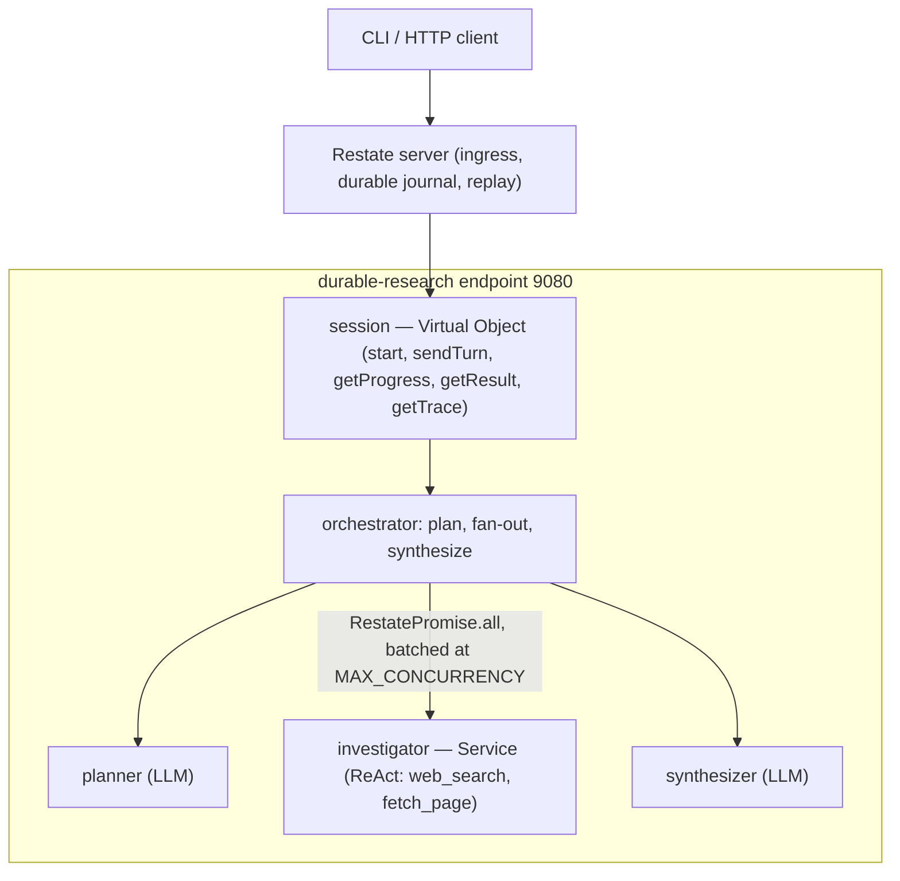

# Durable Multi-Agent Research

[](https://github.com/takabayashi/durable-multi-agent-research-poc/actions/workflows/ci.yml)
[](LICENSE)
[](https://nodejs.org)

[](https://docs.restate.dev)

[](https://biomejs.dev)

A proof-of-concept backend service that powers a multi-turn research assistant on top of [Restate](https://docs.restate.dev) (a durable-execution engine). A user opens a session and sends turns; the system decomposes each research question, investigates sub-questions in parallel, and synthesizes a structured, cited answer. The headline property is **durability**: long-running research survives process restarts, and expensive operations (LLM calls, web searches) are never repeated unnecessarily.

See [`docs/architecture.md`](docs/architecture.md) for a visual architecture map (16 diagrams, rendered inline on GitHub), [`docs/requirements.md`](docs/requirements.md) for the full PRD, [`docs/TODO.md`](docs/TODO.md) for the phased build plan, and [`docs/decisions.md`](docs/decisions.md) for the decision log.

> Status: **Phase 11** — local Kubernetes (minikube) deployment via the Restate Operator (manifests in [`k8s/`](k8s/), with [runbooks](docs/runbooks.md) + a [troubleshooting guide](docs/k8s-troubleshooting.md)); live-cluster validation is the last step. Built so far: durable multi-turn sessions + CLI (2), real planner/synthesizer (3), durable `web_search`/`fetch_page` tools + investigator ReAct loop (4), bounded parallel fan-out (5), crash-resume timeout hardening (6), conversational refinement + context compaction (7), and Tier-2 traces + health/readiness (10). **Future work:** cancellation/supersession + per-session metrics (Phase 8) and a broader automated-test suite (Phase 9) — see "Design note → Status & future work" below. Full roadmap in [`docs/TODO.md`](docs/TODO.md); decision log in [`docs/decisions.md`](docs/decisions.md).

## Design note

### Agent topology

A research turn is an **orchestrator–workers** flow that maps directly onto the problem (decompose → investigate in parallel → synthesize):



> This is the high-level topology. The **full set of diagrams** — file structure, the turn sequence, the investigator ReAct loop, fan-out, durability, observability, the endpoint map, and the Kubernetes deployment — is in [`docs/architecture.md`](docs/architecture.md) (rendered inline on GitHub), with an interactive themed version in [`docs/architecture.html`](docs/architecture.html).

- The **`session` Virtual Object** owns all per-session state (turn history, progress, trace, and the conversation journal). Its `sendTurn` handler is the single writer; `getProgress` / `getResult` / `getTrace` / `getHistory` are concurrent shared (read-only) handlers.
- **`sendTurn`** drives the per-turn orchestrator: the **planner** decomposes the question (bounded breadth), the orchestrator fans out one **`investigator` Service** invocation per sub-question, and the **synthesizer** writes the cited answer. Each investigator runs a ReAct loop over the `web_search` (Tavily) and `fetch_page` tools.
- **Why this shape:** the orchestrator–worker split gives true parallelism and per-sub-question durability (each investigator is its own invocation with its own journal) while keeping all durable session state in one single-writer object. Investigators are *stateless services* rather than individually addressable Virtual Objects — simpler, and still fully journaled (see [`docs/decisions.md`](docs/decisions.md)).

### Restate primitives → properties

- **Virtual Object (`session`)** → durable multi-turn state, one writer per session + concurrent shared reads → observable, mutually isolated sessions (FR1, NFR2, NFR4).
- **`ctx.run` durable steps with stable keys** (every LLM call + every tool call) → journaled and replayed on resume → **crash-resume without repeating completed work** (NFR1, NFR3, FR6).
- **Service invocations + `RestatePromise.all`, batched at `MAX_CONCURRENCY`** → bounded parallel fan-out, each worker independently journaled (FR3, NFR5).
- **Per-service inactivity/abort timeouts** (raised above the longest LLM call, with a shorter OpenAI per-request timeout and retries delegated to `ctx.run`) → long calls aren't mistaken for hangs; a stuck call fails fast and retries durably (Phase 6).
- **Deterministic step names** (`planner`, `synthesizer`, `investigate:<i>:llm:<n>`, …) → logs, the Restate journal, and the per-turn trace all correlate (Phase 10).
- **Operator `RestateCluster` (StatefulSet + PVC) + `RestateDeployment` versioning/draining** → durable state survives pod loss, and a redeploy drains in-flight work with zero loss (Phase 11).

### Key trade-offs

(full rationale in [`docs/decisions.md`](docs/decisions.md))

- **Hand-rolled agent loop on the raw `openai` SDK**, not a framework — maximum control over determinism/replay; we give up framework conveniences.
- **Journal replay over per-call idempotency keys** — replay already prevents repeating *completed* steps; the OpenAI `Idempotency-Key` (which would close the narrow crash-after-return-before-journal window) and a client action key are deferred as low payoff for a POC.
- **Stateless investigator services**, not individually addressable Virtual Objects — simpler; per-subagent live detail is still visible in the Restate UI.
- **Heuristic token estimate** for context compaction, not a real tokenizer; **cost-optimized model tiers** (nano planner) trade a little planning reliability for cost.
- **Single-node Restate, local minikube only** — enough for the POC; multi-node and cloud Kubernetes are out of scope.

### Status & future work

Built: durable sessions + CLI (Phase 2), real planner/synthesizer (3), durable tools + investigator loop (4), bounded parallel fan-out (5), crash-resume timeout hardening (6), conversational refinement + context compaction (7), Tier-2 traces + health/readiness (10), and the minikube/Operator deployment artifacts (11; live validation pending).

Deferred / future work:

- **Cancellation & supersession + per-session metrics** (Phase 8) — a superseding turn cancelling the in-flight one, and a `getMetrics` handler for per-model token + tool-call counts. Not built.
- **Broader automated test suite** (Phase 9) — targeted unit tests exist for pure logic (prompts, tool wrappers, CLI formatting, URL dedup); integration tests via `@restatedev/restate-sdk-testcontainers` and the edge-case matrix are future work.
- **In-flight-window idempotency** (Phase 6) — the OpenAI `Idempotency-Key` + client action key.
- **Out of scope** (tracked in [`docs/TODO.md`](docs/TODO.md)): web UI, image/PDF tools, auth, external persistence, research-quality grading, multi-node Restate, remote/cloud Kubernetes.

## Prerequisites

- **Node.js >= 20** (developed on Node 22).
- **Restate server + CLI, >= 1.4** (the service declares per-service inactivity/abort timeouts, sent during discovery; older servers reject registration). Install per the [Restate docs](https://docs.restate.dev). Quick options:
  - macOS (Homebrew): `brew install restatedev/tap/restate-server restatedev/tap/restate`
  - or run on demand with `npx @restatedev/restate-server` and `npx @restatedev/restate`

## Setup

```bash
npm install
cp .env.example .env   # set OPENAI_API_KEY + TAVILY_API_KEY for live turns (not needed for npm run check)
```

## Build & test

```bash
npm run build          # expect: tsc compiles to dist/ with no errors
npm test               # expect: all tests pass
```

## Run locally

The Restate server runs as a separate process in front of the service. Use three terminals:

```bash
# 1) Start the service (binds an HTTP/2 endpoint on :9080)
npm run dev            # expect: "Restate SDK started listening on 9080..."

# 2) Start the Restate server (ingress :8080, admin/UI :9070)
restate-server         # or: npx @restatedev/restate-server

# 3) Register this deployment with the server (one-time per restart of the service)
restate deployments register http://localhost:9080
```

Then call the durable handler through the Restate ingress:

```bash
curl localhost:8080/greeter/greet --json '{"name":"Ada"}'
# expect: "Hello, Ada! This durable greeter is alive."
```

You can inspect the execution journal (every durable step) in the Restate UI at <http://localhost:9070>.

## Drive it with the CLI

With the service running and registered (see "Run locally"):

```bash
# create a session -> prints a session id
npm run cli start

# send a research turn, stream progress, then print the cited answer
npm run cli turn <sessionId> "Compare Datadog and Snowflake over the last three years"

# print current progress once
npm run cli progress <sessionId>

# print a turn's trace transcript (defaults to the latest turn)
npm run cli trace <sessionId> [turnId]

# print service readiness (which dependencies are configured)
npm run cli health
```

Turns run real LLM agents (set `OPENAI_API_KEY` + `TAVILY_API_KEY` first): the planner decomposes the question, each sub-question is investigated by a ReAct loop over `web_search` + `fetch_page`, and the synthesizer writes a cited answer from the real sources. A trivial query (e.g. "What does NRR stand for?") is answered directly. The CLI prints the cited answer, a per-model token summary, and a per-turn tool-call count. See [`docs/prompts.md`](docs/prompts.md) and [`docs/examples.md`](docs/examples.md). Kill the service mid-turn and restart it - the turn resumes without repeating completed LLM or tool calls.

## Durability & crash-resume

The headline property: a turn survives a process crash and resumes without repeating completed work.

- **Journal replay.** Every LLM and tool call runs inside `ctx.run` with a stable, deterministic step key (`planner`, `synthesizer`, `llm:<n>`, `tool:<n>:<k>`). On resume, completed steps are replayed from Restate's journal — not re-issued — so no finished LLM call or web search runs twice.
- **Long calls aren't killed.** The `session` object and `investigator` service raise Restate's inactivity/abort timeouts (`RESTATE_INACTIVITY_TIMEOUT_MS` / `RESTATE_ABORT_TIMEOUT_MS`) above the longest expected LLM call, while the OpenAI client uses a shorter per-request timeout (`OPENAI_TIMEOUT_MS`) and delegates retries to Restate (`OPENAI_MAX_RETRIES=0`), so a hung call fails fast and is retried durably by `ctx.run`.

The one uncovered edge is the millisecond window where a crash lands after an API call returns but before its result is journaled — that single call would be re-issued on resume. Closing it with per-call idempotency keys (plus a client action key for duplicate sends) is deferred as low-payoff for this POC; see [`docs/decisions.md`](docs/decisions.md).

### Kill / restart demo

```bash
# 1) start a session and send a research turn
npm run cli start                       # -> <sessionId>
npm run cli turn <sessionId> "Compare Datadog and Snowflake over the last three years"

# 2) while it is running, kill the service (Ctrl-C in the `npm run dev` terminal), then restart it
npm run dev                             # same port; Restate redelivers the in-flight invocation

# 3) the turn resumes to completion. Inspect the journal at http://localhost:9070 — completed
#    LLM/tool steps appear as replayed, not re-executed.
```

## Refinement & reuse

Sessions are conversational: a follow-up `turn` reuses the session's prior work instead of starting over. Each turn assembles a **journal** of earlier turns (their questions, key findings, and answers) and feeds it to the planner and synthesizer. The planner then emits only the **new** sub-questions still needed — investigating just the deeper/novel angle and reusing the rest — or none at all when the journal already answers the message (the synthesizer composes from context). The CLI prints, per turn, how many prior turns were reused vs. how many new sub-questions were investigated.

```bash
npm run cli turn <sessionId> "Compare Datadog and Snowflake over the last three years"
npm run cli turn <sessionId> "go deeper on Snowflake's margins"   # reuses the rest; investigates one new angle
```

Freshness: prior turns older than `FRESHNESS_TTL` drop out of the journal and are re-researched if asked again.

### Context compaction

The journal can't grow forever, so when its estimated size exceeds `CONTEXT_MAX_TOKENS` a **compactor agent** folds the oldest turns into a rolling summary, keeping the most recent `MAX_JOURNAL_TURNS` verbatim. Compaction is a durable step (it replays, never re-summarizes, on resume). Per turn the CLI shows a `Context: ~N / M tokens` line and a `(compacting prior context…)` indicator while it runs.

## Observability

The running system is observable at three layers that all key off the **same stable step names**, so logs, the Restate journal, and the per-turn trace correlate.

- **Tier-1 structured logs.** Each LLM step and tool call emits one line through the SDK logger — e.g. `llm step=planner model=… tokens.in=… tokens.out=…`, `tool step=investigate:0:tool:1:0 name=web_search`, and per-turn `turn start|done|failed` lines. The SDK prefixes every line with `[<invocationTarget>][<invocationId>]` (e.g. `session/sendTurn`, `investigator/investigate`); that invocation id is the correlation key shared with the journal and UI. Logs are suppressed during replay, so after a crash/resume only freshly executed steps print. Control verbosity with `RESTATE_LOGGING` (`TRACE|DEBUG|INFO|WARN|ERROR`, default `INFO`); `DEBUG` adds a truncated LLM-output preview per step.
- **Restate journal / UI.** Every durable `ctx.run` step is journaled and visible at <http://localhost:9070>.
- **Tier-2 per-turn trace.** A truncated `TraceEvent[]` is stored on each turn and read back via the `getTrace` shared handler or the CLI:

```bash
npm run cli trace <sessionId> [turnId]   # ordered transcript of the turn's LLM/tool steps
```

Each event carries its stable `step`, a `kind` (`plan|investigate|llm|tool|synthesize|compact`), an optional model + token counts, and a truncated, secret-free detail. The trace is queryable durable state (independent of log level); full per-call args/results stay in the journal.

### Step-name convention

Deterministic and stable across replay so the three surfaces line up:

- `planner` / `synthesizer` — the planning and synthesis calls (in the Session invocation).
- `compact` — a journal-compaction summary call.
- `investigate:<i>:llm:<n>` (and `investigate:<i>:llm:final` for the degraded summary) plus `investigate:<i>:tool:<n>:<k>` — the i-th sub-question's investigator loop, which runs as its own `investigator` service invocation (`i` = sub-question index, `n` = loop turn, `k` = tool-call index).

### Health

- **Liveness** — the service endpoint answers `/health` with `200 OK` (built into the SDK). The endpoint speaks HTTP/2 cleartext (h2c), so a raw curl must request prior-knowledge HTTP/2 (a plain HTTP/1.1 curl fails with "Received HTTP/0.9 when not allowed"):

```bash
curl --http2-prior-knowledge localhost:9080/health   # expect: OK
```
- **Readiness** — the `health` service reports whether dependencies are configured, as booleans only (never secret values):

```bash
npm run cli health                       # or: curl localhost:8080/health/check --json '{}'
# { "status": "ok", "service": "durable-research", "checks": { "openai": true, "tavily": true } }
```

`status` is `degraded` when a required key is missing.

### Restate UI walkthrough — a tool-call lifecycle

With a turn running or finished, open <http://localhost:9070>, find the `session/sendTurn` invocation, and follow its journaled steps in order: `planner` → the fanned-out `investigator/investigate` invocations (each with `investigate:<i>:llm:<n>` and `investigate:<i>:tool:<n>:<k>` steps whose args/results you can inspect) → `synthesizer`. The same step names appear in the logs and in `npm run cli trace`, so you can pivot across the three views by step name and invocation id.

## Project layout

```
src/
  app.ts              # endpoint entrypoint: binds services, listens on :9080
  cli.ts              # CLI client (start / turn / progress)
  cli.output.ts       # pure CLI presentation helpers (progress, results)
  greeting.ts         # pure greeting logic (unit-tested)
  services/
    greeter.ts        # Phase 0 durable "greeter" service
    health.ts         # readiness handler (complements the SDK's built-in /health liveness)
  llm/
    client.ts         # lazy OpenAI client (reads OPENAI_API_KEY)
    wrapper.ts        # callStructured + callTools: durable LLM calls (ctx.run)
    format.ts         # shared prompt-formatting helpers (untrusted-data block, truncation)
  tools/
    search.ts         # web_search (Tavily) durable tool
    fetch.ts          # fetch_page (readability + linkedom) durable tool
    registry.ts       # TOOL_DEFS, runTool dispatch, collectSources
    url.ts            # normalizeUrl for source dedup
  agents/
    orchestrator.ts   # per-turn flow: plan -> investigate -> synthesize (runResearch)
    planner.ts        # durable plan() (journal-aware); planner.prompt.ts holds its prompt + schema
    investigator.ts   # stateless investigator service (ReAct loop); investigator.prompt.ts holds its prompt
    synthesizer.ts    # durable synthesize(); synthesizer.prompt.ts holds its prompt + schema
    journal.ts        # pure: build the conversation journal + token estimate
    compactor.ts      # durable rolling-summary compactor; compactor.prompt.ts holds its prompt + schema
  session/
    session.ts        # durable Session virtual object (start/sendTurn/getProgress/getResult)
    types.ts          # session / turn / progress types
docs/                 # PRD, TODO, traceability, decisions, examples, prompts
```

## Configuration

Configuration is via environment variables (see [`.env.example`](.env.example)). Live turns need `OPENAI_API_KEY` and `TAVILY_API_KEY`; the per-role models (`OPENAI_MODEL_PLANNER` / `_INVESTIGATOR` / `_SYNTHESIZER`), the breadth cap (`MAX_SUBQUESTIONS`, default 5), and the tool bounds (`WEB_SEARCH_MAX_RESULTS`, `FETCH_PAGE_MAX_CHARS`, `MAX_TOOL_TURNS`, `MAX_SOURCES`) are read at runtime. `MAX_CONCURRENCY` (default 3) bounds how many investigators run at once. `PORT` (default `9080`) sets the service endpoint. The durability knobs (`OPENAI_TIMEOUT_MS`, `OPENAI_MAX_RETRIES`, `RESTATE_INACTIVITY_TIMEOUT_MS`, `RESTATE_ABORT_TIMEOUT_MS`) are covered in "Durability & crash-resume"; the refinement/compaction knobs (`FRESHNESS_TTL`, `MAX_JOURNAL_TURNS`, `CONTEXT_MAX_TOKENS`, `JOURNAL_MAX_CHARS_PER_TURN`, `OPENAI_MODEL_COMPACTOR`) in "Refinement & reuse"; and the observability knobs (`RESTATE_LOGGING`, `TRACE_MAX_EVENTS`) in "Observability".

## Continuous integration

GitHub Actions ([`.github/workflows/ci.yml`](.github/workflows/ci.yml)) runs on every push and pull request: lint + format check (Biome), typecheck, build, tests, a gitleaks secret scan, and a Docker build with a startup smoke test. Local equivalents:

```bash
npm run lint        # Biome: lint + format + import-order check
npm run format      # Biome: auto-fix
npm run typecheck   # tsc --noEmit
npm run build
npm test
```

## Build the container

```bash
docker build --platform linux/arm64 -t durable-research .
docker run --rm -p 9080:9080 durable-research
# expect: "Restate SDK started listening on 9080..."
```

The image is multi-stage (build then a slim runtime), runs as a non-root user, and exposes `9080`. Register it with a running Restate server exactly as in "Run locally".

## Deploy on minikube (Operator)

Run the whole system on a local Kubernetes cluster using the [Restate Operator](https://docs.restate.dev/guides/restate-on-kind-with-operator): it deploys the Restate server (a `RestateCluster` → single-node StatefulSet + PVC) and the service (a `RestateDeployment`), and **auto-registers + versions** the service — no manual `restate deployments register`. Manifests live in [`k8s/`](k8s/); full procedures (deploy, roll out + roll back, recover, rotate keys, resume, teardown) are in [`docs/runbooks.md`](docs/runbooks.md), and the top-10 failure guide is in [`docs/k8s-troubleshooting.md`](docs/k8s-troubleshooting.md).

Prerequisites: Docker, `minikube`, `kubectl`, `helm` (the `restate` CLI is optional). Set `OPENAI_API_KEY` + `TAVILY_API_KEY` in `.env`.

```bash
# cluster + operator
minikube start --cpus=4 --memory=6144
helm install restate-operator oci://ghcr.io/restatedev/restate-operator-helm \
  --namespace restate-operator --create-namespace

# Restate server (operator creates the StatefulSet + Service + PVC in ns restate)
kubectl apply -f k8s/restate-cluster.yaml
kubectl -n restate rollout status statefulset/restate --timeout=180s

# build + load the service image into the cluster (--platform matches the arm64 node)
docker build --platform linux/arm64 -t durable-research:0.1.0 .
minikube image load durable-research:0.1.0

# API keys via a Secret (from .env, never in the image) + non-secret config
set -a; source .env; set +a
kubectl -n restate create secret generic durable-research-secrets \
  --from-literal=OPENAI_API_KEY="$OPENAI_API_KEY" \
  --from-literal=TAVILY_API_KEY="$TAVILY_API_KEY"
kubectl apply -f k8s/config.yaml

# deploy the service (auto-registered by the operator)
kubectl apply -f k8s/restate-deployment.yaml
```

Drive it from your laptop by port-forwarding the Restate ingress (and UI at <http://localhost:9070>):

```bash
kubectl -n restate port-forward svc/restate 8080:8080 9070:9070
RESTATE_INGRESS_URL=http://localhost:8080 npm run cli start
RESTATE_INGRESS_URL=http://localhost:8080 npm run cli turn <sessionId> "Compare Datadog and Snowflake over the last three years"
```

**Durability demos.** With a turn in flight: bump the image tag and re-apply the `RestateDeployment` to watch a **zero-downtime versioned redeploy** (the old version drains its in-flight turn while new turns go to the new version), or delete the service pod (`kubectl -n restate delete pod -l app=durable-research`) to watch the turn **resume via journal replay**. Step-by-step in [`docs/runbooks.md`](docs/runbooks.md).

Secrets are injected via a Kubernetes `Secret` built from `.env` and are never baked into the image; on minikube the cluster's NetworkPolicies are disabled (the default CNI doesn't enforce them) — keep them on in production. See [`docs/decisions.md`](docs/decisions.md).

## Rotating keys

Secrets live only in `.env` (gitignored); the repo ships `.env.example` placeholders, and CI runs gitleaks to catch accidental commits. To rotate a key: revoke/replace `OPENAI_API_KEY` / `TAVILY_API_KEY` at the provider, update your local `.env`, and restart the service. If a key is ever committed, rotate it immediately — repository history is public.
