# Architecture

A visual map of the durable multi-agent research assistant, derived directly from the `src/` tree and
the `k8s/` manifests. GitHub renders the Mermaid blocks below inline — no setup needed.

> There is also a richer, interactive version with a dark/light theme toggle in
> [`architecture.html`](architecture.html) in this folder (open it locally in a browser).

For the narrative design note (agent topology, Restate primitives → properties, trade-offs), see the
[README](../README.md#design-note); the decision log is in [`decisions.md`](./decisions.md).

## Contents

1. [Project file structure](#1-project-file-structure)
2. [System layers overview](#2-system-layers-overview)
3. [Research turn flow](#3-research-turn-flow)
4. [Investigator ReAct loop](#4-investigator-react-loop)
5. [Fan-out and concurrency](#5-fan-out-and-concurrency)
6. [Provider abstraction](#6-provider-abstraction)
7. [Domain model](#7-domain-model)
8. [Session lifecycle](#8-session-lifecycle)
9. [Conversation journal and compaction](#9-conversation-journal-and-compaction)
10. [Durability and crash-resume](#10-durability-and-crash-resume)
11. [Observability](#11-observability)
12. [Handler and endpoint map](#12-handler-and-endpoint-map)
13. [End-to-end user journey](#13-end-to-end-user-journey)
14. [Kubernetes deployment](#14-kubernetes-deployment)

> **Legend.** Indigo = durable / stateful; teal = stateless compute; purple = external provider.

---

## 1. Project file structure

How the `src/` tree is organised — entry points, agents, the LLM transport layer, durable tools,
services, and the session state object.

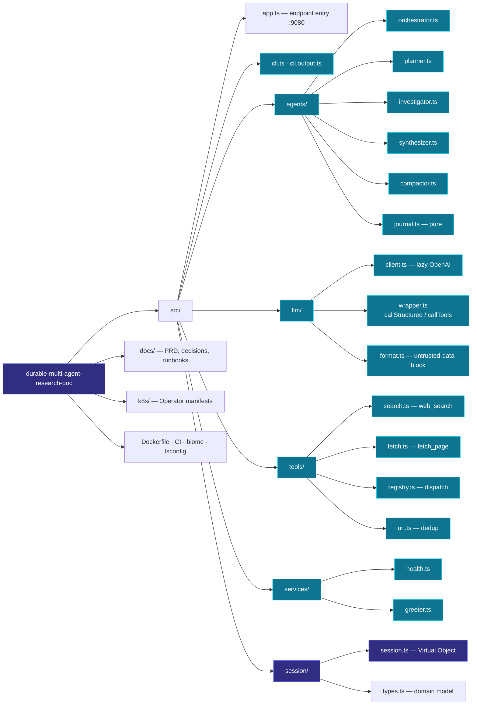

## 2. System layers overview

From the CLI down to external providers. The Restate server sits in front as ingress + durable
journal; every agent call eventually reaches OpenAI or Tavily.

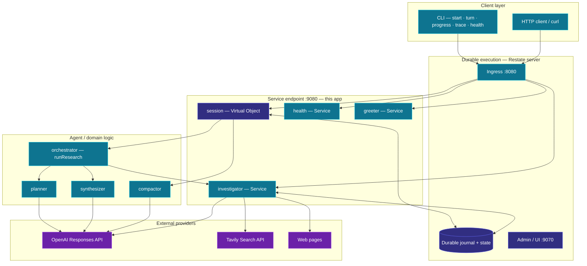

## 3. Research turn flow

The orchestrator–worker sequence behind one `sendTurn`: the planner decomposes, investigators fan out
concurrently, the synthesizer writes a cited answer. The CLI polls progress out-of-band.

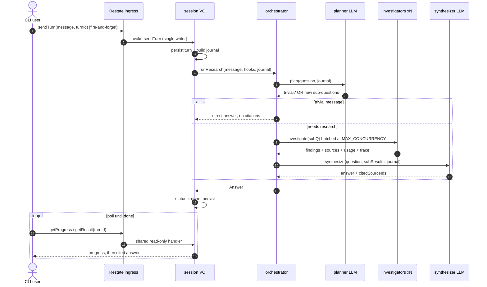

## 4. Investigator ReAct loop

Each investigator is a stateless Service running a bounded ReAct loop. Every LLM turn and every tool
call is its own `ctx.run` step, so completed steps replay on resume — no duplicate external calls.

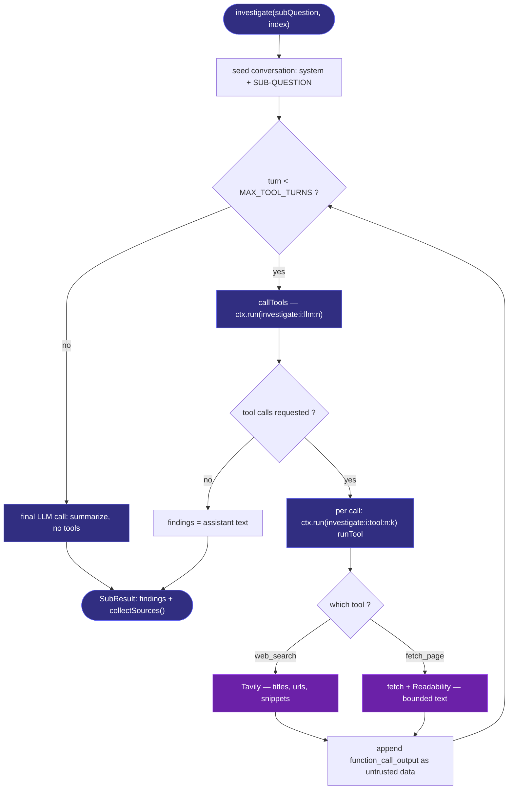

## 5. Fan-out and concurrency

Planner breadth is capped server-side at `MAX_SUBQUESTIONS`; investigators run via `RestatePromise.all`
in batches of `MAX_CONCURRENCY`. Bounds are enforced by us, never by the model — they cap rate and cost.

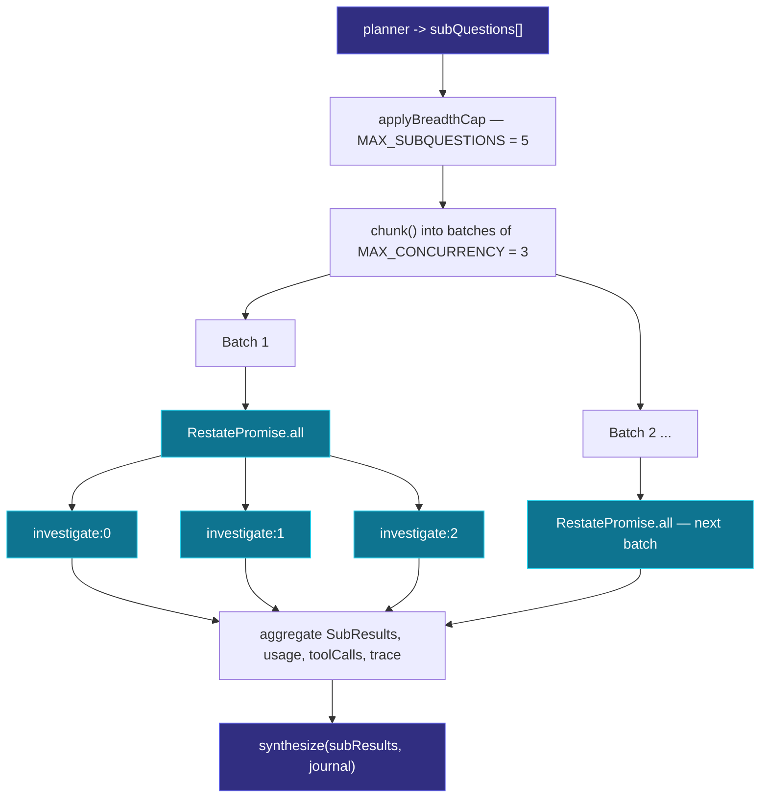

## 6. Provider abstraction

Every model call funnels through one durable entry point. `callStructured` (Zod-typed JSON) and
`callTools` (ReAct) both wrap `ctx.run`; `getOpenAI` is a lazy singleton with retries delegated to
Restate. The tool registry validates model arguments before dispatching.

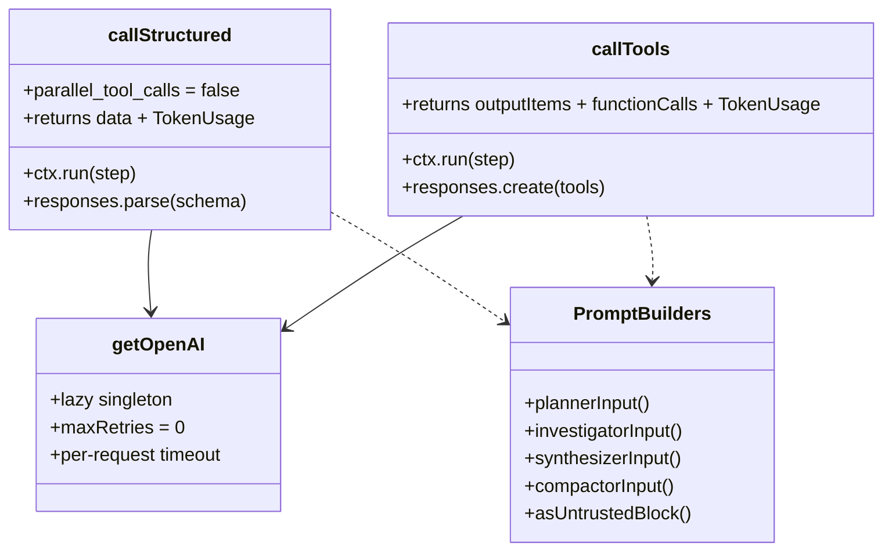

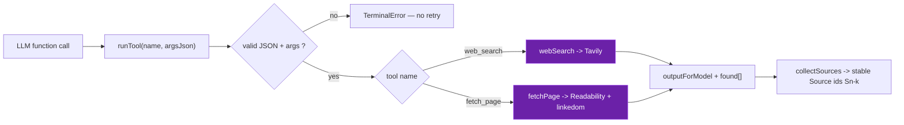

## 7. Domain model

The durable shapes persisted on the session (`src/session/types.ts`). A `Turn` aggregates
sub-questions, an answer, token usage, tool counts, a context snapshot, and a Tier-2 trace.

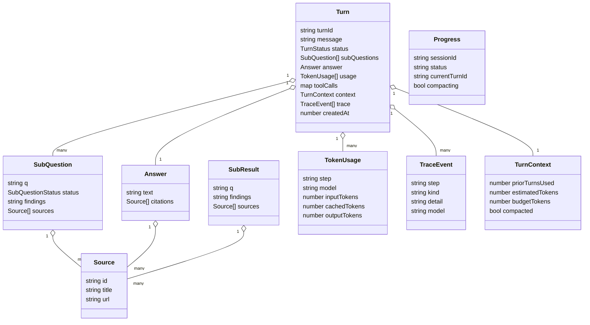

## 8. Session lifecycle

A session is a keyed Virtual Object. `start()` seeds it; each `sendTurn` moves the current turn through
`running → done/failed` while persisting progress, and follow-ups reuse prior turns. Sub-questions move
through their own `pending → running → done` states.

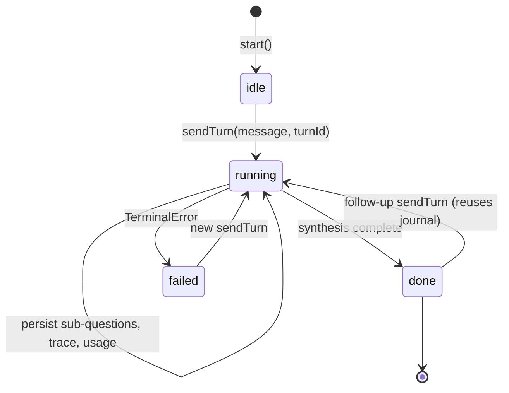

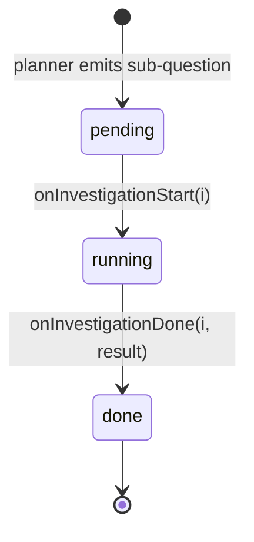

> Restate's single-writer guarantee makes `sendTurn` the only mutator while `getProgress` /
> `getResult` / `getTrace` / `getHistory` run as concurrent shared reads. Durable state survives server
> restarts.

## 9. Conversation journal and compaction

Refinement & reuse (Phase 7): each turn builds a journal of prior turns for the planner/synthesizer.
Stale turns expire; when the journal outgrows the token budget, the compactor folds the oldest into a
rolling summary.

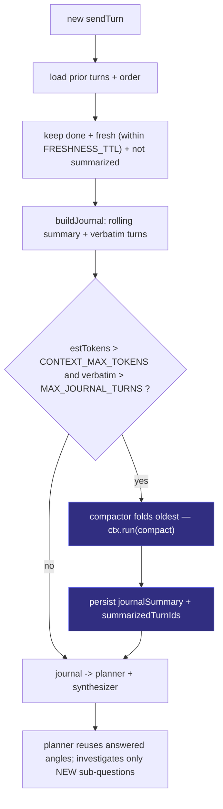

> This is reuse, not idempotency: the planner sees earlier findings and only researches new angles, so
> a follow-up like *"go deeper on Snowflake margins"* issues fewer LLM/tool calls.

## 10. Durability and crash-resume

The headline property. Every external effect is wrapped in `ctx.run` under a stable, deterministic step
key, so on crash/redelivery completed steps replay from the journal instead of re-executing.

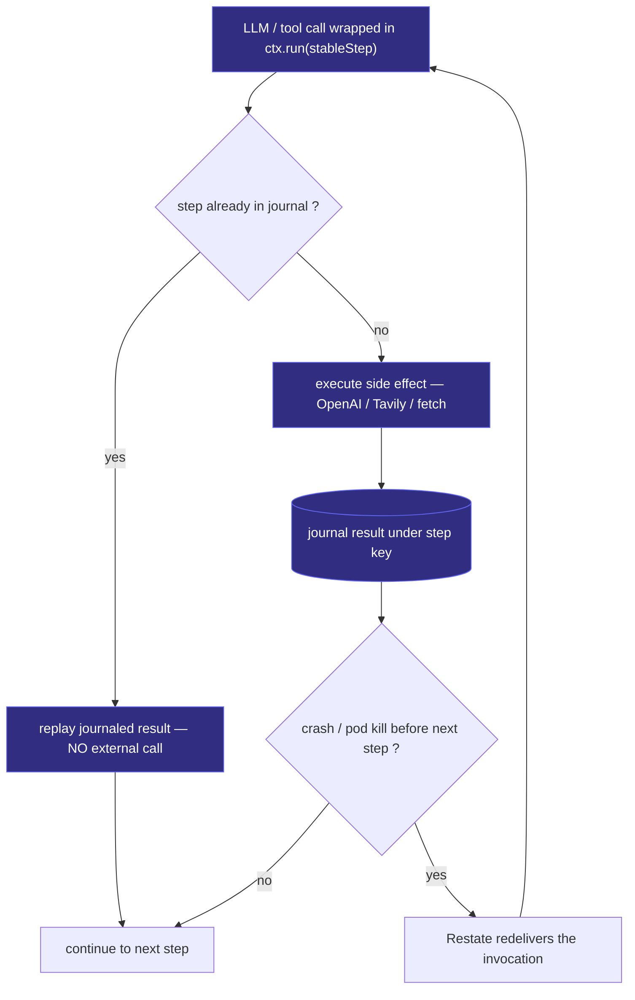

> Timeouts are tuned so long LLM calls are not mistaken for hangs: the service raises
> `RESTATE_INACTIVITY_TIMEOUT_MS` above the longest call, while OpenAI uses a shorter per-request
> timeout with `maxRetries=0` — retries belong to `ctx.run`.

## 11. Observability

Logs, the Restate journal, and the per-turn trace all key off the same stable step names, so you can
pivot across them by step name and invocation id.

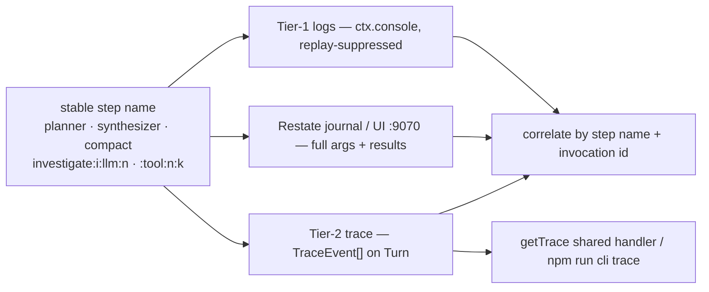

## 12. Handler and endpoint map

Restate services and their handlers, and which CLI command drives each. The `session` object is the
stateful core; `investigator`, `health` and `greeter` are stateless services.

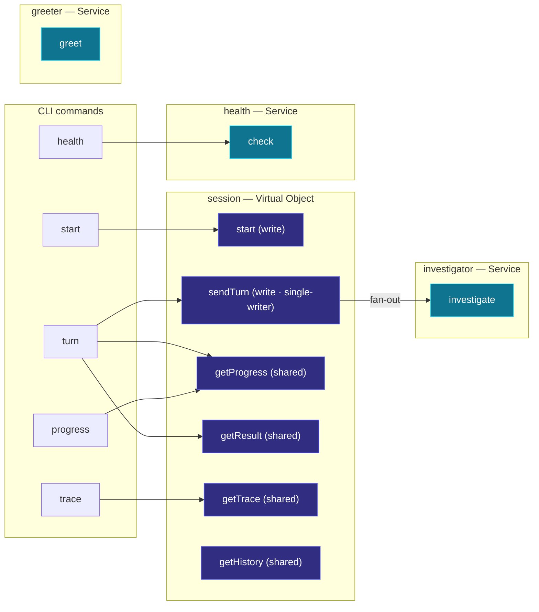

## 13. End-to-end user journey

From creating a session to a cited answer and a context-reusing follow-up — the whole demo path in one
view.

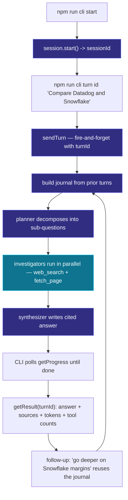

## 14. Kubernetes deployment

Phase 11 runs the whole system on minikube. The Restate Operator reconciles a `RestateCluster`
(StatefulSet + PVC) and a `RestateDeployment` that it auto-registers and versions for zero-downtime
redeploys.

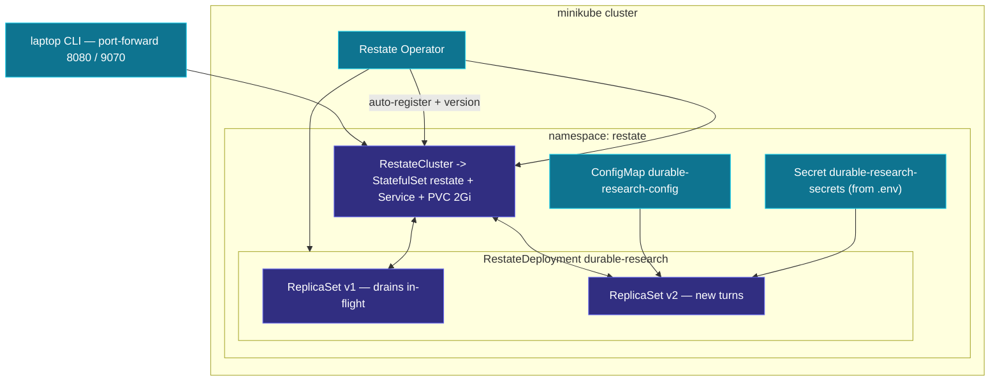

> On a new image tag the operator spins up `v2` and routes new invocations there while `v1` keeps
> running until its in-flight turns drain — a zero-downtime versioned redeploy. The PVC keeps durable
> state across pod restarts.
