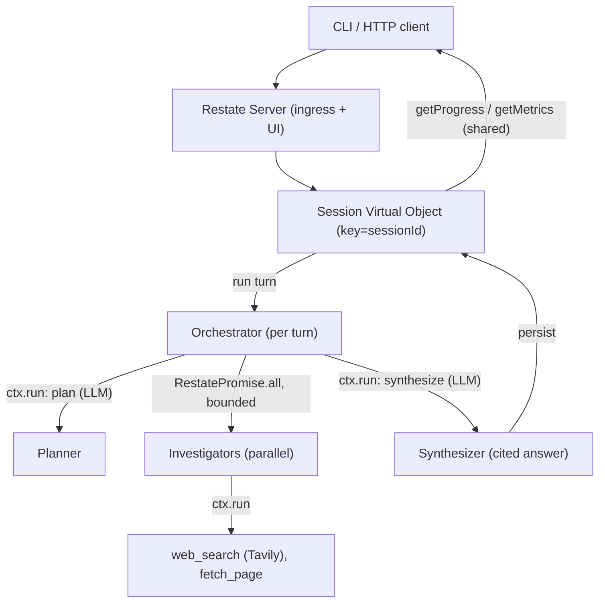

# Durable Multi-Agent Research — Product Requirements (PRD)

> A proof-of-concept backend service that powers a multi-turn research assistant on top of
> [Restate](https://docs.restate.dev) (a durable-execution engine). A user opens a session and sends
> turns; the system decomposes each research question, investigates sub-questions in parallel, and
> synthesizes a structured, cited answer. The headline property is **durability**: long-running
> research survives process restarts, and expensive operations (LLM calls, web searches) are never
> repeated unnecessarily. This is a learning/reference POC, not a production product.

---

## Problem Statement

Long-running, multi-step LLM research workflows are expensive and fragile. A single process crash can
lose in-flight progress and force re-running costly LLM calls and web searches; concurrent user
sessions can interfere with one another; and naive retries can duplicate expensive external effects.

**The core job: given a user's research question inside a session, durably decompose it, investigate
its sub-questions in parallel, and synthesize a cited answer — surviving process restarts without
repeating completed work.**

This POC explores how a durable-execution engine (Restate) provides the persistence, isolation, and
idempotency needed to make a multi-agent research workflow reliable, without reaching for an external
database.

## Target Users

- **Primary — researcher/user:** drives research questions through the API/CLI across multi-turn
  sessions and wants structured, cited answers that build on earlier turns.
- **Secondary — operator:** observes what the system is doing during a long-running turn (which
  sub-questions exist, what is complete vs pending) and verifies that work resumes after a crash.
- **Tertiary — developer:** reads the codebase as a reference for durable multi-agent patterns on
  Restate (agent loop, parallel fan-out, idempotency, state modeling).

## Core Features

- As a user, I can **start a session** and receive a session ID, so my research context persists
  across turns and across server restarts.
- As a user, I can **send a turn** (a new question, a refinement, or a follow-up) and receive a
  structured answer that **cites its sources**.
- As a user, I can ask a complex question and have it **decomposed into sub-questions** that are
  **investigated in parallel** rather than in a sequential loop.
- As a user/operator, I can **observe progress** during a long-running turn (sub-question statuses:
  pending / running / done / failed).
- As a user, I can **refine** a prior answer ("go deeper on point 3") and have the system **reuse
  relevant prior work** instead of starting over.
- As a user/operator, if the server is **killed mid-research**, on restart it **resumes** the in-flight
  turn without repeating completed LLM calls or tool calls.
- As a user, I can see **token usage and tool-call counts per session**.
- As a user, I can **cancel or supersede** an in-flight turn (e.g., a new turn that contradicts the
  one in progress).

## User Flows

**1. Start a session**
1. Client calls `startSession` → receives `sessionId`.
2. Session state is created in a Restate Virtual Object keyed by `sessionId`.

**2. Send a research turn (long-running)**
1. Client calls `sendTurn(sessionId, message)`.
2. **Planner** decomposes the question into sub-questions (bounded breadth).
3. **Investigators** run in parallel (bounded concurrency); each uses `web_search` (Tavily) and
   `fetch_page` tools in a durable ReAct loop.
4. **Synthesizer** combines sub-results into a structured, cited answer.
5. The answer + sub-results + metrics are persisted to session state.

**3. Observe progress**
1. Client polls `getProgress(sessionId)` for structured sub-question statuses, or
2. Operator watches the live execution journal in the Restate UI.

**4. Refinement / reuse**
1. Client sends a refinement ("go deeper on point N").
2. System looks up prior sub-results for that point in session state; if fresh (within
   `FRESHNESS_TTL`), it reuses them and investigates only the deeper angle; otherwise it refreshes.

**5. Resume after failure**
1. Server is killed mid-turn.
2. On restart, Restate replays the invocation journal: completed LLM/tool steps are replayed from the
   journal (not re-executed); execution resumes from the first incomplete step and the turn completes.

**6. Internal processing flow (orchestrator-workers + ReAct)**
1. Orchestrator: `plan → fan-out workers (bounded) → synthesize`.
2. Each investigator: `LLM call → (tool calls)* → sub-answer`, every step wrapped in `ctx.run`.

## Technical Constraints

- **Runtime:** Node.js + TypeScript. The Restate Server runs in front of the service (local
  single-node for development; local minikube for the Kubernetes target).
- **Stack:** `@restatedev/restate-sdk` (handlers), `@restatedev/restate-sdk-clients` (CLI), the raw
  `openai` SDK (hand-rolled agent loop), and the Tavily API for web search.
- **State storage:** Restate Virtual Objects / Workflows **only** — no external database
  (Postgres/Redis/etc.) by design. All session state is addressable by `sessionId`.
- **Configuration via env:** `OPENAI_API_KEY`, `TAVILY_API_KEY`, model names (planner / investigator /
  synthesizer), `MAX_SUBQUESTIONS`, `MAX_CONCURRENCY`, `FRESHNESS_TTL`, ingress/admin URLs, log level.
- **One-command run:** documented in the README (start Restate Server, start the service, register the
  deployment, drive with the CLI).
- **Determinism for replay:** every non-deterministic operation (LLM calls, tool calls, time, random,
  UUIDs) is wrapped in `ctx.run` / `ctx.rand`. Native LLM parallel tool-calls are disabled; parallelism
  is expressed with Restate combinators (`RestatePromise.all`).
- **Bounded concurrency:** decomposition breadth is an agentic decision capped at `MAX_SUBQUESTIONS`;
  the number of investigators running at once is an enforced guardrail (`MAX_CONCURRENCY`).
- **Long LLM calls:** Restate inactivity/abort timeouts are raised so multi-minute LLM calls are not
  treated as hangs.
- **Deployment scope:** local minikube only; remote/cloud Kubernetes is out of scope.

## Security Considerations

- **Secrets:** API keys are provided only via environment variables / a gitignored `.env`; never
  committed. `.env.example` ships placeholders. The repository is public, so the first commit is kept
  clean and history is treated as permanent.
- **Untrusted input:** user questions and **fetched web content are untrusted**. Fetched content is
  treated strictly as data, never as instructions, to limit prompt-injection; tool outputs are size-
  bounded and truncated before being fed back to the model.
- **AuthN/AuthZ:** none (out of scope for the POC). The service must not be exposed publicly as-is;
  authentication/authorization is a prerequisite for any real deployment.
- **Exposure surface:** the Restate ingress and the service handlers are intended for local/dev use.
- **Output posture:** answers are **advisory** — research correctness is not guaranteed; every answer
  carries citations so the user can verify.
- **Logs/traces:** structured logs and stored traces are truncated and must never contain secrets.

## Error Handling & Edge Cases

- **Malformed input:** validated at the handler boundary; invalid requests fail with a terminal error
  (no retries).
- **Transient LLM/tool failures:** retried by `ctx.run` with bounded exponential backoff; a
  `TerminalError` after max attempts stops the retry loop.
- **Crash / restart:** the invocation journal is replayed; completed steps are not re-executed, so no
  duplicate LLM calls or web searches.
- **Idempotency / dedup:** client supplies an idempotency key per send-action; each durable step uses a
  deterministic key; the OpenAI `Idempotency-Key` header covers the in-flight-at-crash window.
- **Backpressure:** fan-out is processed in batches of `MAX_CONCURRENCY` to protect rate limits, cost,
  and memory.
- **Tool/network failures:** an investigator degrades gracefully — it returns a best-effort sub-answer
  noting any gaps rather than failing the whole turn.
- **Refinement edge cases:** if there is no prior work for the referenced point, or it is stale (older
  than `FRESHNESS_TTL`), the system falls back to a fresh investigation.
- **Over-broad / trivial questions:** breadth is capped; trivial questions may be answered immediately
  by the planner without decomposition.
- **Cancellation / supersession:** a superseding turn cancels the in-flight invocation and marks the
  prior turn superseded in session state.
- **Startup ordering:** the service deployment must be registered with Restate before invocations are
  routed.

## Success Metrics

- **Reproducibility:** a documented one-command local run brings the system up end-to-end.
- **Durability:** killing the server mid-research and restarting resumes the turn with **zero repeated
  completed LLM/tool calls** (verifiable in the journal/logs).
- **Parallelism:** sub-questions are demonstrably investigated concurrently, within the configured
  bound.
- **Isolation:** concurrent sessions complete without interfering with one another's state.
- **Observability:** sub-question progress and per-session token/tool metrics are queryable at any time.
- **Idempotency:** retries and resumes do not duplicate expensive external effects.

## Out of Scope

- **Minimal web UI** — a CLI is sufficient to drive and demo the system.
- **`extract_image_content` / `extract_pdf_content` tools** — `web_search` + `fetch_page` cover the core
  flow; multimodal tools add cost/complexity without changing the architecture.
- **Authentication / authorization** — not needed to demonstrate durability and concurrency.
- **External persistence (Postgres/Redis/etc.)** — intentionally relying only on Restate state.
- **Research-quality grading** — the focus is the system that produces answers, not answer correctness.
- **Multi-node Restate** — a single local node is enough for the POC.
- **Remote / cloud Kubernetes** — deployment is demonstrated on local minikube only.

## Appendix — Tech Stack

| Component | Choice |
|-----------|--------|
| Language | TypeScript (Node.js) |
| Durable execution | Restate (`@restatedev/restate-sdk`), local single-node server |
| External client | `@restatedev/restate-sdk-clients` (CLI) |
| LLM | OpenAI API via the raw `openai` SDK (hand-rolled agent loop) |
| Web search | Tavily API (`web_search`) |
| Page fetch | HTTP fetch (`fetch_page`) |
| State store | Restate Virtual Objects / Workflows (no external DB) |
| Tests | Vitest + `@restatedev/restate-sdk-testcontainers` |
| Packaging | Docker image; deployed to local minikube |
| CI | GitHub Actions (typecheck, lint, build, test, secret-scan) |
